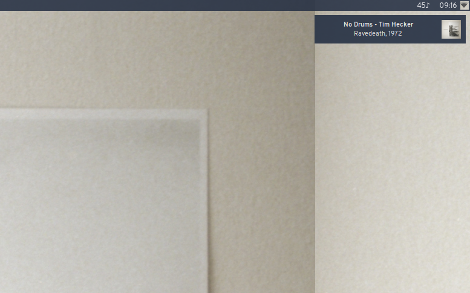

# mpd-notify

* Notifications on song change, play, and pause.
* Automatic cover art detection.
* Updates wallpaper on song change.

_I use [dunst](https://wiki.archlinux.org/index.php/Dunst). Your notifications may look slightly different._

## Install:
Requires [Stack](https://docs.haskellstack.org/en/stable/README/), Feh, libnotify-dev, libghc-gtk-dev

    git clone https://github.com/charlesschimmel/mpd-notify-hs
    cd mpd-notify
    stack install

## Run:
    Usage: mpd-notify --library PATH [--port INT] [--host STRING]
      Display notifications for MPD

    Available options:
      --library PATH           Path to music library
      --port INT               Port of target MPD server (default: 6600)
      --host STRING            Host of target MPD server (default: "localhost")
      -h,--help                Show this help text
